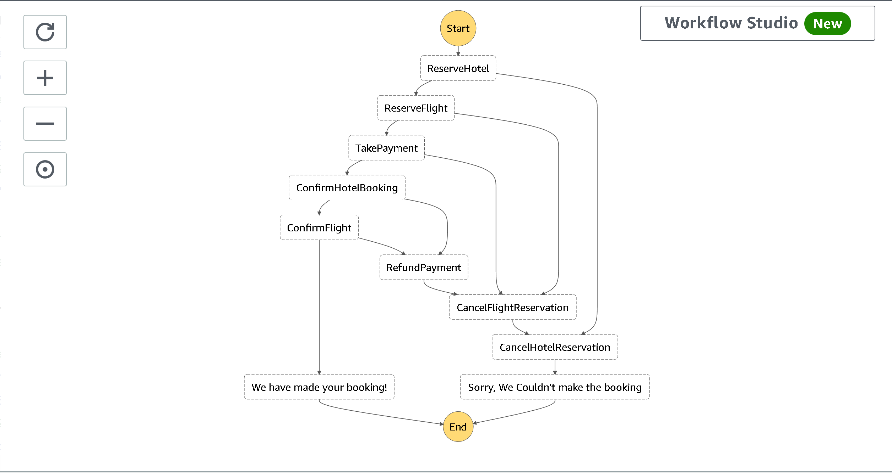

# Welcome to a holiday booking stepfunction  CDK project

 

This is a holiday booking stepfunction CDK project with TypeScript.

 

The `cdk.json` file tells the CDK Toolkit how to execute your app.

 

## Useful commands

- `npm run build` compile typescript to js
- `npm run watch` watch for changes and compile
- `npm run test` perform the jest unit tests
- `cdk deploy` deploy this stack to your default AWS account/region
- `cdk diff` compare deployed stack with current state
- `cdk synth` emits the synthesized CloudFormation template
